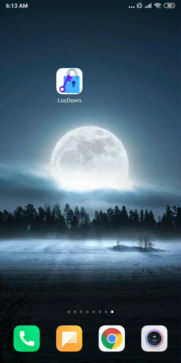
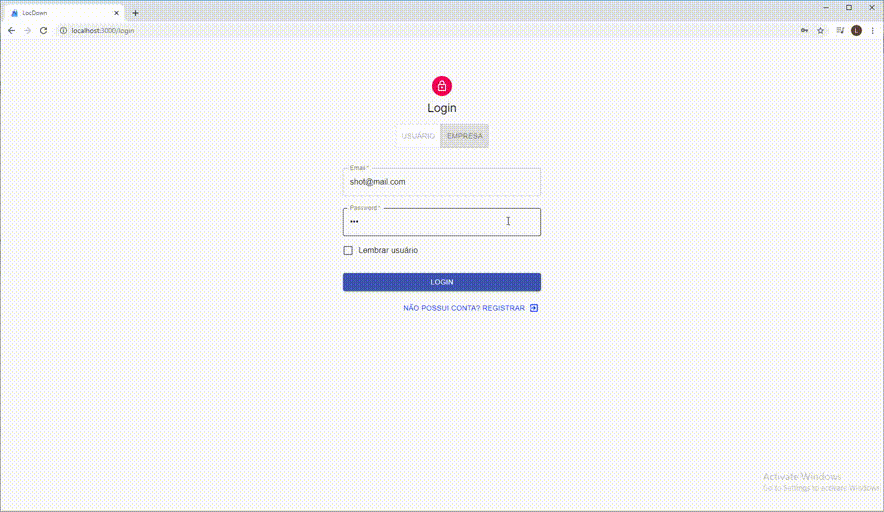
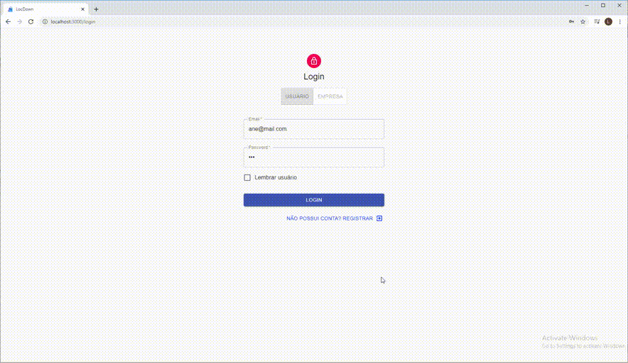

# LocDown: E-commerce Local
O LocDown é um projeto desenvolvido para o MegaHack.<br/>O Desafio que buscamos solucionar foi o da empresa VTex, a qual tem foco na expansão de negócios por comércio colaborativo.<br>
A plataforma LocDown pode ser acessada em: https://locdown-megahack.herokuapp.com

"<i>Com o grande número de comércios fechados na atual crise, os comerciantes locais, principalmente varejistas, tiveram de fechar as portas e perderam vendas, pois necessitam do contato físico para isso e não estavam preparados para aderir ao E-commerce tradicional devido a sua complexa logística (entregas nacionais/correios) e relativo custo.
<p>Visualizando esse problema, o LocDown é uma solução que visa proporcionar uma plataforma de E-COMMERCE LOCAL, no qual empresas podem vender produtos para clientes de sua cidade de forma digital, evitando o contato físico e mantendo o comércio aquecido. Focando no comércio local, garante-se também entregas rápidas, como delivery, algo não encontrado no varejo local.<p>Com isso o LocDown procura trazer uma nova forma de comércio varejista local, que possibilite ao vendedor usar a tecnologia para manter-se trabalhando durante a crise</i>".

#### Telas da aplicação & Fluxo de Execução (FIGMA)
Todas as telas e fluxo de execução da aplicação (Web/Mobile) podem ser visualizados no Figma pelo seguinte link: <a href="https://www.figma.com/file/7EBM5HmE4tfIpKU1d4DI4G/LocDown-APP-View?node-id=0%3A1">Visualizar Projeto LocDown (Figma)</a>

#### Tecnologias Utilizadas

* FrontEnd: <b>ReactJs</b>
* BackEnd: <b>NodeJs</b>
* Mobile: <b>Ionic</b>
* Database: <b>MongoDB</b>

#### Executando
O Projeto esta preparado para ser executado em Localhost, bastando baixar o projeto e iniciar o <i>FrontEnd</i> com ```yarn install``` e ```yarn start```. E o <i>BackEnd</i> com ```node src/index.js```.
O banco de dados exige o MongoDB instalado e inicia-se automaticamente em localhost.

#### Funcionalidades Implementadas:

 * Cliente:
    * Visualizar Lojas locais.
    * Visualizar Produtos dessas Lojas.
    * Comprar um Produto.
    * Visualizar sua compra/pedido.
    * Contatar vendedor no Whatsapp  diretamente via APP (para dúvidas).
    * Visualizar seu perfil.

 * Empresa:
    * Cadastrar produtos em sua loja (com opção de estoque múltiplo para para produtos que possuam diferentes tamanhos/numeração como roupas/calçados).
    * Visualizar produtos cadastrados.
    * Visualizar vendas e dados do pedido/cliente para entrega do produto.
    * Contatar comprador no Whatsapp  diretamente via APP (para informações/entrega).
    * Visualizar seu perfil.

#### Uso de API's
A API externa utilizada no projeto foi a de busca de CEP para obtenção de dados como endereço e cidade. Como o sistema baseia-se no comércio local, utiliza-se da cidade do usuário para limitar as lojas na qual ele tem acesso, o mesmo acontece para o vendedor, o qual a visualização dos seus produtos é restrita somente para usuários de sua cidade.

## Exemplos de Interfaces do Projeto

#### Login de Usuário no Mobile/Android


#### Login de Vendedor e Visualização de seu Estoque


#### Usuário: Login até a Compra de Produto (Ciclo Completo)
